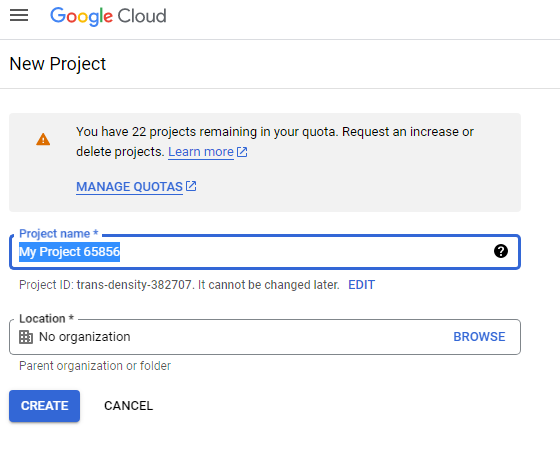
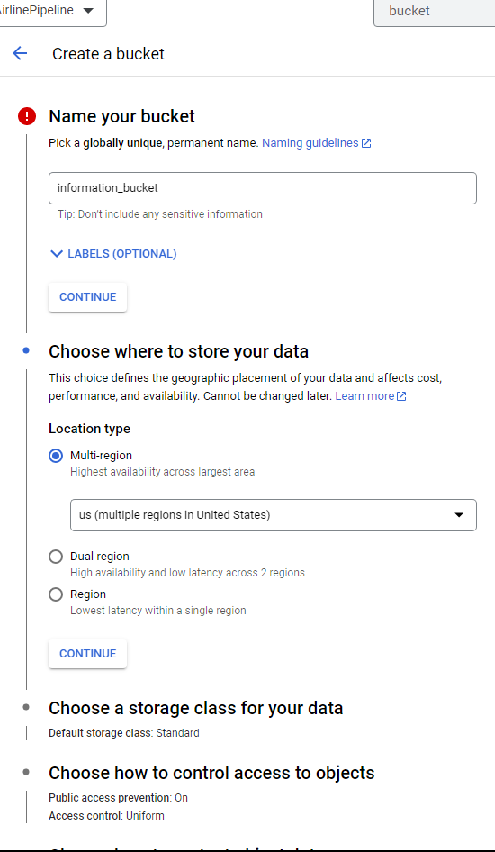
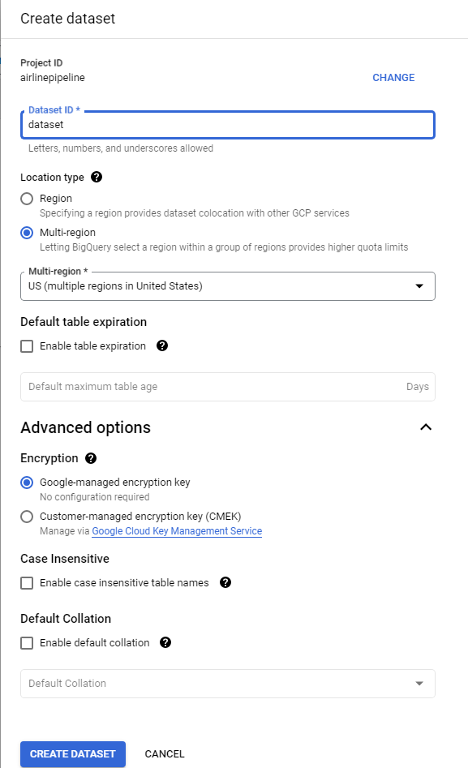

# Tutorials on how to setup and run this project

## Table of Content

=================

- [Creating a Dev Container](#creating-a-dev-container)
- [Setting up GCP Services](#setting-up-gcp-services)
- [Orchestration with Prefect](#orchestration-with-prefect)
- [Data transformations with dbt](#data-transformations-with-dbt)

For this project, to ensure minimal compactibility issues, I used a Dev Container in VSCode to create a developement environment with the help of Docker.

---

### Creating a Dev Container

To create a dev container,

1. Install Visual Studio Code and Docker on your machine, if you haven't already

   - To install VSCode, you can easily download it from [here](https://code.visualstudio.com/) after selecting your appropriate system architecture.
   - Docker can be downloaded from [here](https://www.docker.com/products/docker-desktop/)

2. Create a new folder for your project and open it in Visual Studio Code.

3. Create a new file named "Dockerfile" in the root directory of your project.

4. Open the Dockerfile in Visual Studio Code and add the following lines and save the file:

```bash
FROM python:3.10-slim-buster

# Install Jupyter
RUN pip install jupyter

# Install Prefect
RUN pip install prefect

# Install Git
RUN apt-get update && \
    apt-get install -y git

# Install PySpark
RUN apt-get update && \
    apt-get install -y openjdk-11-jdk-headless && \
    pip install pyspark

# Install dbt-bigquery
RUN pip install dbt-bigquery

# Install Piperider
RUN pip install piperider

# Install Google Cloud
RUN pip install google-cloud-storage
RUN pip install google-cloud-bigquery

# Install Pandas
RUN pip install pandas

# Set environment variables for PySpark
ENV PYSPARK_PYTHON=python3
ENV PYSPARK_DRIVER_PYTHON=jupyter
ENV PYSPARK_DRIVER_PYTHON_OPTS='lab --ip=0.0.0.0 --port=8888 --no-browser'

# Set working directory
WORKDIR /app

# Create output directory
RUN mkdir /app/output

# Set volume for output directory
VOLUME /app/output

# Expose port for Jupyter
EXPOSE 8888

# Start PySpark
CMD ["pyspark"]

```

5. Install the Dev Containers extension by Microsoft on VS Code. A green `><` symbol should appear at the bottom left corner of VSCode.

6. Click the green icon and select `Remote-Containers: Open Folder in Container`

7. In the .devcontainer created, there's a `devcontainer.json` file. Adjust the `dockerfile` key to the value of "Dockerfile".

8. Add any extensions needed under extensions

9. To rebuild container, click the green icon and select `Rebuild container with cache`

---

### Setting up GCP services

Google Cloud is a suite of Cloud Computing services offered by Google that provides various services like compute, storage, networking, and many more. It is organized into Regions and Zones.

Setting up GCP would require a GCP account. A GCP account can be created for free on trial but would still require a credit card to signup.

1. Start by creating a GCP account at [this link](https://cloud.google.com/)
2. Navigate to the GCP Console and create a new project. Give the project an appropriate name and take note of the project ID
<table><tr>
<td>  </td>
<td>  </td>
</tr></table>

3. Create a service account.

   - In the left sidebar, click on "IAM & Admin" and then click on "Service accounts."

   - Click the "Create service account" button at the top of the page.

   - Enter a name for your service account and a description (optional).

   - Select the roles you want to grant to the service account. For this project, select the BigQuery Admin, Storage Admin, and Storage Object Admin Roles.

   - Click "Create" to create the service account.

   - After you've created the service account, you can download its private key file. This key file will be used to authenticate requests to GCP services.

   - Click on the service account you just created to view its details.

   - Click on the "Keys" tab and then click the "Add Key" button.

   - Select the "JSON" key type and click "Create" to download the private key file. This key would be used to interact to the google API from Prefect or Python

   - Rename and store the json key as you please or you can add it to system environment using the `export GOOGLE_APPLICATION_CREDENTIALS="~/.google/credentials/google_credentials.json"` command

4. Create a Cloud Storage bucket to store your data. You can do this by navigating to the Cloud Storage section of the console and clicking "Create Bucket". Be sure to take note of the location of your bucket.

5. Create a BigQuery dataset to store your data. You can do this by navigating to the BigQuery section of the console, selecting your project, and clicking "Create Dataset". Also mind the location when creating a dataset.

<table><tr>
<td>  </td>
<td>  </td>
</tr></table>

---

### Orchestration with Prefect

Prefect is a powerful workflow management system for data engineering that makes it easy to build, schedule, and monitor complex workflows in a variety of environments.
Prefect is already installed by the Dockerfile used to create a dev container.

- To startup prefect server, run `prefect orion start` or `prefect server start` in your terminal.
  This would start a server with a dashboard that you can access at `http://127.0.0.1:4200`
  

- Import Prefect into your scritp and add prefect decorators to define tasks and flow

  ```python
  # Importing prefect
  from prefect import flow, task
  from prefect.tasks import task_input_hash, exponential_backoff
  ```

  example task decorator

  ```python
  @task(name='download_data', retries=3, retry_delay_seconds=exponential_backoff(backoff_factor=10), cache_key_fn=task_input_hash, cache_expiration=timedelta(days=1))
  def download_data(url: str, output_dir: str) -> str:
    ...
  ```

- Use python script to create prefect deployments by running `prefect deployment build main/etl_web_gcp.py:main_etl -n "web_to_bucket"` command.

  Note that

  - `main/etl_web_gcp` refers to the file name
  - `main_etl` refers to the flow, and
  - `web_to_bucket` is the name we're giving the deployment

  After running the command, a `main_etl-deployment.yaml` file is created.
  You can adjust the settings of the deployment in the file before applying it.

- To apply the deployment, use the command `prefect deployment apply main_etl-deployment.yaml`
- Start the agent with `prefect agent start -q 'default'` to run the deployment in the `default` queue.

You can add as many deployments as is neccessary to create your complete workflow orchestration. In this project, I have two deployments scheduled to run after the other has finished.

---

### Data transformations with dbt
